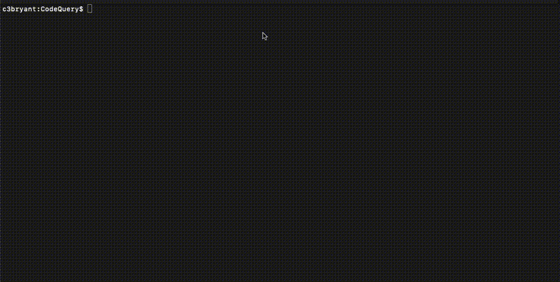

# Code Query

<p align="center">
    
</p>

## Overview

Code Query is a command-line utility for developers, enabling comprehensive analyses of their codebases with the use of advanced AI technology. By leveraging OpenAI's latest models, it provides insightful context into the code, aimed at enhancing both understanding and quality. The tool is designed to support analysis across a range of scopes, from individual files to multiple directories, gathering context and engaging an AI model for in-depth examination.

While capable of handling large datasets, the tool supports extensive context analyses up to 128k tokens, making it possible to thoroughly examine code in projects of varying sizes. This functionality is currently in a prototype stage, designed to offer developers initial insights and a basis for further development in navigating complex code environments.

## Features
- **AI-Powered Insights**: Harnesses the capabilities of OpenAI GPT models to deliver deep contextual analysis of code, offering actionable intelligence.
- **Adaptable Scope of Analysis**: Enables analysis at both granular and broad scales, catering to specific files or entire projects without specified directories.
- **Detailed Output and Logging**: Directly outputs the responses from the LLM, including token count and the specific LLM model type used for the analysis.

## Usage

```bash
python3 codequery.py 'your_query_here' [optional_path1 optional_path2 ...]
```

- **Query**: A required argument that specifies the query or command for the analysis.
- **Paths**: Optional arguments that define specific directories or files to be analyzed. If omitted, the script defaults to analyzing the current working directory.

## Requirements

1. Python 3.x
2. Installed dependencies from `requirements.txt`

```bash
pip3 install -r requirements.txt
```
3. OpenAI API key
  - You must create an `.env` file at the root of the project with the `OPENAI_API_KEY` variable set to your OpenAI API key like so:
```
OPENAI_API_KEY=your_openai_api_key_here
```
4. Code Context CLI tool
  - To make the `codequery.py` script work, you need to install the [Code Context](https://github.com/UCSD/CodeContext) CLI tool and make sure it's in your system's PATH. This tool gathers the needed information from chosen directories or files, which the AI models then analyze.

  Follow the installation guide provided with the `Code Context` tool. Ensure it's correctly installed and can be called from your terminal or command prompt.


## Author

Charles Bryant (c3bryant@ucsd.edu)

## Version

1.0.0
